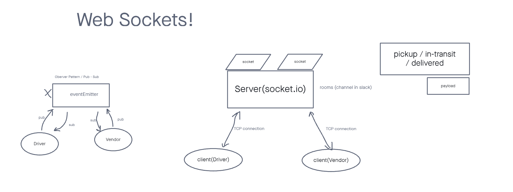

# caps

## CAPS

Phase 1: Begin the build of an application for a product called CAPS - The Code Academy Parcel Service. In this sprint, we’ll build out a system that emulates a real world supply chain. CAPS will simulate a delivery service where vendors (such a flower shops) will ship products using our delivery service and when our drivers deliver them, each vendor will be notified that their customers received what they purchased.

This will be an event driven application that “distributes” the responsibility for logging to separate modules, using only events to trigger logging based on activity.

The following user/developer stories detail the major functionality for this phase of the project.

- As a vendor, I want to alert the system when I have a package to be picked up.
- As a driver, I want to be notified when there is a package to be delivered.
- As a driver, I want to alert the system when I have picked up a package and it is in transit.
- As a driver, I want to alert the system when a package has been delivered.
- As a vendor, I want to be notified when my package has been delivered.

## Testing

Write a complete set of tests for all functional units and modules
Your tests must be running green on Github Actions
[TESTS](./__tests__)

## Documentation

Compose a UML or Process/Data Flow Diagram for every application
UML Reference

This should be the first thing you do when beginning work on a lab assignment.
Draw the process/data flow of your application and map it to the code you will need to write or evaluate/fix.

## Web Socket

[Heroku](https://smith-caps.herokuapp.com/caps) 

Heroku instruction code to start up server : node driver/index.js

Local Server: node global/app.js

Communication standards for computers.

7 layers

The top layer is more facing, the bottom layer is very Computer 

7 layer application layer - HTTP / FTP / IMAP

* Express == HTTP
* Stateless, a request is sent and response returned.
* Once response is returned connection is ended.

TCP lives on the 4th layer _ Transport layer

* Socket.io == TCP
* Connection id sustained between 2  machines.
* Full Duplex, information can flow between both machines simultaneously.

- eventEmitter change to socketio.
- client side
- server side

bottom layer physical(elections flowing between physical system)
socket.io, socket.io-client
